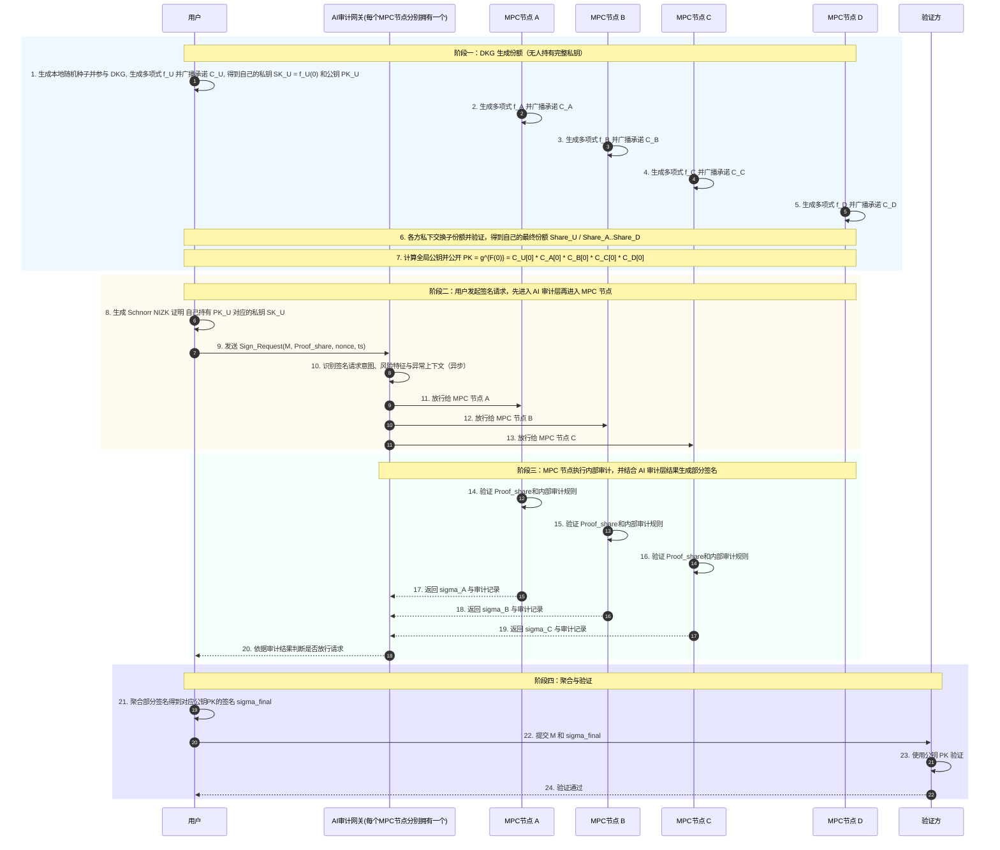

# Avis Introduction

## 项目目标

1. 通过 DKG 生成阈值密钥材料，确保没有单点持有完整私钥，只有达到 n out-of N 中的 n 个节点才能产生合法签名。
2. 通过 Feldman VSS 验证份额，确保每个子份额都可被公开承诺校验。
3. 通过 Schnorr NIZK 证明份额控制权，确保发起签名请求的一方确实持有合法份额。
4. 通过 BLS 部分签名和聚合，得到可验证的最终签名。
5. 给前端、后端和未来的 AI agent 提供清晰的协议入口和调试面板。

## Flow Chart



## 当前架构

- `src/`：Tauri 前端。
- `src-tauri/`：Tauri Rust 命令层，负责连接Tauri App与底层Rust数学库。
- `crates/math_core/`：密码学核心库，包含 DKG、VSS、Schnorr 和 BLS 基础实现。
- `api/openapi.yaml`：接口草案，描述健康检查、DKG、证明验证、部分签名和聚合接口。
- `api/server_example/`：axum 示例后端，用于验证前端请求和协议消息格式。

## 如何运行

### 环境搭建
1. 克隆仓库并进入目录：

```bash
git clone https://github.com/klizz111/avis.git 
```

2. 安装相关依赖

```bash
# 在根目录下运行安装Tauri依赖
pnpm install
```

### 运行前端+后端

```bash
# 在根目录下运行
pnpm start:all
```
### 前端开发

```bash
pnpm dev
```

### Tauri 桌面开发

```bash
pnpm tauri dev
```

### iOS 开发

```bash
pnpm tauri ios dev
```

## 协议简述

### DKG 和 VSS

每个参与方本地选择多项式：

$$
f_i(x) = a_{i,0} + a_{i,1}x + \cdots + a_{i,t-1}x^{t-1}
$$

公开承诺：

$$
C_{i,k} = g^{a_{i,k}}
$$

分发给第 $j$ 方的份额：

$$
s_{i\to j} = f_i(j)
$$

校验式：

$$
g^{s_{i\to j}} \stackrel{?}{=} \prod_{k=0}^{t-1} C_{i,k}^{j^k}
$$

最终每个参与者得到自己的总份额：

$$
S_j = \sum_i s_{i\to j}
$$

全局公钥与私钥常数项一致：

$$
PK = g^{F(0)} = \prod_i C_{i,0}
$$

### 份额控制证明

用户在发起签名前，需要对自己的份额做 Schnorr NIZK 证明：

$$
c = H(PK_{share} \parallel R \parallel M \parallel nonce \parallel ts)
$$

$$
s = k + c \cdot Share_U
$$

节点侧验证：

$$
sG \stackrel{?}{=} R + c \cdot PK_{share}
$$

### 阈值签名聚合

单个部分签名：

$$
\sigma_j = S_j \cdot H(m)
$$

使用拉格朗日系数聚合：

$$
\sigma_{final} = \sum_{j \in \mathcal{T}} \lambda_j \cdot \sigma_j
$$

最终结果等价于完整私钥签名：

$$
\sigma_{final} = SK \cdot H(m)
$$

### 后端示例

如果你要调试 HTTP 接口，可以运行 `api/server_example` 对应的示例服务。

## 当前待办

- [x] DKG/VSS 基础逻辑和验证路径
- [x] Schnorr 份额控制证明
- [x] BLS 部分签名与聚合路径
- [x] Tauri 前端改造为协议工作台
- [x] 示例后端和前端构建通过
- [ ] 把 Tauri 前端和示例后端进一步对齐成稳定的交互流程
- [x] 把部分签名的响应解析、去重和聚合流程做成更完整的用户操作
- [x] 补充端到端模拟：多节点 DKG -> 份额验证 -> 证明 -> 部分签名 -> 聚合
- [ ] 将 API 草案和后端实现进一步收敛，减少示例字段和最终字段之间的偏差
- [ ] 增加更正式的错误处理、审计日志和重放保护展示

## 给后续开发者 / AI agent 的提示

- 优先看 `crates/math_core`，协议正确性都从这里开始。
- 前端目前是一个协议控制台，不是业务产品界面，先保证流程可跑通，再谈收敛和美化。
- `api/openapi.yaml` 是接口契约，改后端之前最好先看这里。
- `tmp/scheme.md` 里已经写了 DKG 和阈值签名的数学说明，适合用来对照实现。
- 如果要继续扩展功能，优先补一个完整的端到端小闭环，而不是零散补页面。